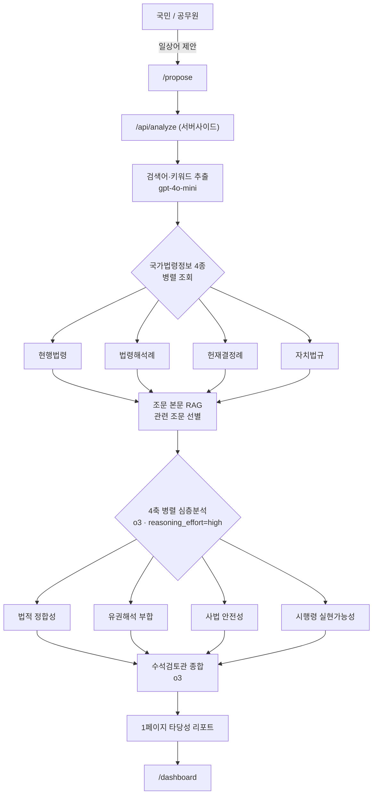

# 법령이음 (Legis-Pilot)

[](https://github.com/junghyun-coding/legis-pilot/actions/workflows/ci.yml)
&nbsp;[](https://legis-pilot.vercel.app)
&nbsp;[](LICENSE)
&nbsp;
&nbsp;

> 입법 제안 **법적 타당성 검토** 및 시행령 정비 지원 AI
> 제2회 법령데이터 활용 아이디어 공모전 (법제처) · 제품 및 서비스 개발 부문

국민의 입법 제안을 **국가법령정보**(법제처 공식 데이터)와 실시간으로 대조하여 시행령
정비 타당성을 판정하고, 부처 협의용 1페이지 검토 리포트를 자동 생성하는 법제 업무 보조
AI입니다. **AI가 인용하는 법령·해석례·판례는 모두 국가법령정보 Open API로 실재가 확인된
것만** 사용하고, 관련 법령의 **실제 조문 본문**까지 읽어 근거로 삼아 할루시네이션을 차단합니다.

🔗 **Live: https://legis-pilot.vercel.app**

---

## 목차

- [핵심 흐름](#핵심-흐름)
- [아키텍처](#아키텍처)
- [화면](#화면)
- [기술 스택](#기술-스택)
- [설계 하이라이트](#설계-하이라이트)
- [타당성 점수 산정](#타당성-점수-산정)
- [실측 예시](#실측-예시)
- [로컬 실행](#로컬-실행)
- [현재 한계 & 로드맵](#현재-한계--로드맵-정직하게)

## 화면

> 라이브 데모: **https://legis-pilot.vercel.app** — 캡처 이미지는 `docs/images/`에 넣으면 아래에 표시됩니다([캡처 가이드](docs/images/GUIDE.md)).

<!-- docs/images/ 에 캡처(landing/propose/report/dashboard .png)를 추가한 뒤 아래 주석을 해제하세요.
| 랜딩 | 제안 입력 + AI 사전검토 |
|---|---|
|  |  |

| 타당성 리포트 | 검토 대시보드 |
|---|---|
|  |  |
-->

---

## 핵심 흐름

1. **제안 입력** (`/propose`) — 국민이 일상어로 입력 → LLM이 관련 법령 검색어·키워드 추출
2. **국가법령정보 4종 실시간 조회** — 현행법령·법령해석례·헌재결정례·자치법규(조례)를 **병렬** 조회
3. **조문 RAG + 4축 멀티에이전트 분석** — 최상위 법령의 실제 조문을 읽고, 4개 판단축을 각각
   `o3`로 **병렬 심층분석**한 뒤 수석검토관이 종합 (법적 정합성·유권해석 부합·사법 안전성·시행령 실현가능성)
4. **타당성 판정 + 1페이지 리포트** (`/dashboard`) — 정비 권고 / 조건부 검토 / 정비 부적합
   + 입법형식 판단(시행령 vs 법률 개정) + PDF 출력

## 아키텍처



## 기술 스택

- **Next.js 16** (App Router) · React 19 · TypeScript · Tailwind CSS v4
- **LLM**: OpenAI — 검색어 추출(`gpt-4o-mini`) + 타당성 분석(`o3`, 4축 병렬 멀티콜 + 종합),
  구조화 JSON 출력. o3 미가용/오류 시 경량 모델로 안전 폴백.
- **법령 데이터**: 국가법령정보 공유 서비스(공공데이터포털 1170000) — XML 응답을 `fast-xml-parser`로 파싱
- **배포**: Vercel · **CI**: GitHub Actions (lint · typecheck · build)

## 활용 데이터 (국가법령정보 공유 서비스)

| 데이터 | 엔드포인트 | 용도 |
|---|---|---|
| 현행 법령 | `lawSearchList` | 상위법 충돌·정합성 검토 |
| 법령 조문 본문 | `lawService` | 실제 조항 인용·근거 (RAG) |
| 법령해석례 | `expcSearchList` | 유권해석 일관성 검증 |
| 헌재결정례 | `detcSearchList` | 위헌·무효 등 사법 리스크 |
| 자치법규(조례) | `ordinSearchList` | 지자체 정비 맥락 |

모든 호출은 **서버사이드**에서 이뤄집니다. 법령은 키 미설정·API 장애 시 실존 법령명 시드로
폴백하고, 해석례·헌재·조례는 **실연동 결과가 없으면 가짜 데이터를 만들지 않고 표시하지
않습니다**(빈 섹션). 법령해석례는 일반어로 폴백돼 무관한 결과가 잡히는 것을 막기 위해 **구체
주제어 기반 관련성 게이트**로 필터링합니다.

## 설계 하이라이트

- **할루시네이션 차단** — AI에게 "법령을 기억해 말하라"가 아니라, API로 실재 확인된 목록과
  실제 조문 본문만 컨텍스트로 주고 "여기 없는 건 지어내지 말라"고 강제. *실재 보장 ≠ AI 추측.*
- **4축 멀티에이전트 분석** — 단일 호출로 8개 필드를 한 번에 뽑던 구조를, 판단축별 전문
  분석관 4명이 `reasoning_effort: high`로 병렬 심층분석 → 수석검토관이 종합. 점수는 각
  전문가가 산정, 종합은 서술만 통합.
- **조문 본문 RAG** — 법령 '이름'이 아니라 실제 '조문'을 키워드 관련도로 선별해 근거로 제공
  → 분석이 구체 조항(예 `전기통신금융사기특별법 제3조제1항`)을 직접 인용.
- **재현성** — 동일 제안 → 동일 리포트 보장(모듈 캐시), 경계 점수에서 판정이 뒤집히지 않게.
- **우아한 폴백 체인** — API 키 없음/장애 → 실존 법령명 시드, LLM 실패 → 경량 모델 → 목업.
  *데모가 절대 비지 않음.*

## 타당성 점수 산정

4축을 가중합해 0~100 점수를 내고 판정합니다.

- 가중치: 법적 정합성 `0.35` · 사법 안전성 `0.30` · 유권해석 부합 `0.20` · 시행령 실현가능성 `0.15`
- 판정: 68점↑ **정비 권고** / 45점↑ **조건부 검토** / 그 미만 **정비 부적합**

## 실측 예시

입력 *"보이스피싱 피해자 즉시 계좌 동결 권한 부여"* →

- 처리: **27.5초** (o3 5콜: 4축 + 종합, gpt-4o-mini 추출 1콜)
- 판정: **정비 권고 / 타당성 80** (법적정합성 82·유권해석 82·사법안전 75·실현가능성 85), 충돌 위험 낮음
- 근거: *"전기통신금융사기특별법 제3조제1항이 이미 부여한 피해자 신청권의 전자적 확대에 불과해 법체계와 부합"* — 실제 조문 인용

---

## 로컬 실행

```bash
npm install
cp .env.example .env.local   # 값 채우기
npm run dev                  # http://localhost:3000
```

### 환경변수 (`.env.local`)

```
OPENAI_API_KEY=sk-...                 # OpenAI API 키
OPENAI_ANALYZE_MODEL=o3               # (선택) 분석 모델, 기본 o3
OPENAI_MODEL=gpt-4o-mini              # (선택) 추출 모델, 기본 gpt-4o-mini
LAW_API_KEY=...                       # 국가법령정보 인증키(encoding 값)
LAW_OC=...                            # (선택) 조문 본문 조회용 OC
```

> ⚠️ `.env.local`은 git에 커밋되지 않습니다(`.gitignore`). 키를 코드/문서에 하드코딩하지 마세요.
> 키가 없어도 앱은 시드 데이터로 동작하지만, 실데이터 연동을 보려면 키가 필요합니다.

## 프로젝트 구조

```
app/
  page.tsx              랜딩
  propose/page.tsx      국민 제안 입력 + AI 사전검토
  dashboard/page.tsx    공무원 검토 대시보드 + 1페이지 리포트
  api/analyze/route.ts  분석 파이프라인 (핵심)
lib/
  lawApi.ts             국가법령정보 4종 어댑터 (XML 파싱 + 시드 폴백 + 관련성 게이트)
  lawText.ts            조문 본문 조회 + 관련 조문 선별 (RAG)
  lawRerank.ts          관련 법령 결정적 재랭킹
  llm.ts                OpenAI 호출 래퍼 (reasoning_effort + 폴백)
  prompt.ts             LLM 프롬프트 (검색어 추출 / 축별 분석 / 종합)
  scoring.ts            4축 가중합 + 판정 (정비 권고/조건부/부적합)
  store.ts              제안 상태 (localStorage)
components/ReportView.tsx   1페이지 타당성 리포트 UI
data/                   시드 데이터 (API 폴백용)
types.ts                공용 타입
```

---

## 현재 한계 & 로드맵 (정직하게)

**구현된 것**
- 국가법령정보 4종 실시간 연동, 조문 본문 RAG, 실존 근거만 인용, o3 4축 타당성 판정,
  입법형식 판단, 1페이지 리포트 PDF 출력, 웹앱 배포, CI

**한계**
- 판정 점수는 LLM 추정값이라 변동 가능 — **정답셋 기반 정확도 평가는 미실시**.
- 조문 대조는 최상위 소관 법령 중심 — 복수 법령 조문을 한 줄씩 교차 대조하진 않음.
- 제안 데이터는 브라우저 localStorage 저장(서버 DB·로그인 없음).

**로드맵**
- 정확도 벤치마크(정답셋) 구축
- 복수 법령 조문 교차 대조, 대법원 판례·정부입법예고 결합
- 고급 분석(GNN/시계열/XAI)은 연구 과제

---

## 라이선스 / 기여

[MIT](LICENSE) · 기여 방법은 [CONTRIBUTING.md](CONTRIBUTING.md), 보안 신고는 [SECURITY.md](SECURITY.md) 참고.

---

본 프로젝트는 제2회 법령데이터 활용 아이디어 공모전(법제처) 제출용 시제품(MVP)입니다.
</content>
</invoke>
